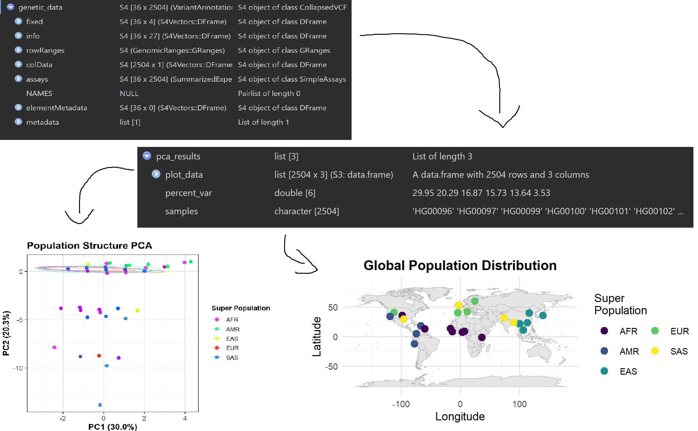

<!-- README.md is generated from README.Rmd. Please edit that file -->

# genRelateR

## Description

genRelateR is a tool for analyzing global human genomic relatedness
across populations. The package addresses the need for efficient
handling and analysis of large genomic datasets by providing specialized
functions that streamline common tasks such as filtering samples,
managing metadata, and performing population-based analyses. By
integrating with established bioinformatics tools like VariantAnnotation
and SummarizedExperiment, this package simplifies the process of working
with genomic data in R. It empowers users to conduct exploratory
analyses quickly and efficiently, reducing the complexity of data
manipulation and making it easier to focus on higher-level analyses such
as population structure exploration. The `genRelateR` package was
developed using `R version 4.4.1 (2024-06-14 ucrt)`,
`Platform: x86_64-w64-mingw32/x64` and
`Running under: Windows 10 x64 (build 19045)`.

## Installation

To install the latest version of the package:

``` r
install.packages("devtools")
library(devtools)
options(repos = BiocManager::repositories())
devtools::install_github("bdls-jamal/genRelateR", build_vignettes = TRUE)
library(genRelateR) 
```

To run the Shiny app:

``` r
rungenRelateR()
```

## Overview

``` r
ls("package:genRelateR")
data(package = "genRelateR")
browseVignettes("genRelateR")
```

`genRelateR` contains 6 functions.

1.  ***loadGeneticData()*** loads and formats genetic vcf data from
    various sources
2.  ***filterPopulation()*** filters data based on population,
    geographic region, or genetic criteria
3.  ***analyzePopulationStructure()*** performs PCA analysis on
    population data
4.  ***plotPopulationPca()*** plots population structure using PCA
5.  ***plotAncestryMap()*** maps the distribution of genetic ancestry
    components
6.  ***createRelatednessDashboard()*** generates an interactive shiny
    dashboard for exploring relatedness data

This package also contains sample 1000 genome project data found in the
data folder. You may use these for initial analyses and then download
other files from the project later.

Refer to package vignettes for more details. An overview of the package
is illustrated below.

<figure>

<figcaption aria-hidden="true">Overview of Functions Output</figcaption>
</figure>

## Contributions

The author of this package is Kobi Jamal Schmalenberg. The author wrote
all of the functions in this package. Generative AI tools were used in
all functions for proofing, optimization suggestions, and to help easily
replicate styling conventions.

This package leverages several widely-used R packages to perform key
tasks. Here are the primary contributions:

- VariantAnnotation: Used for reading and processing VCF files.
- dplyr: Essential for manipulating population metadata, allowing
  flexible filtering of samples based on various criteria such as
  population and super-population.
- SummarizedExperiment: Utilized for handling collapsed VCF data and
  extracting genotype information efficiently.
- GenomicRanges: Employed for managing genomic regions, making it easier
  to specify regions of interest within large genomic datasets.

## References

- Becker, R. A., Chambers, J. M. and Wilks, A. R. (1988) The New S
  Language. Wadsworth & Brooks/Cole.
- Mardia, K. V., J. T. Kent, and J. M. Bibby (1979) Multivariate
  Analysis, London: Academic Press.
- R Core Team (2024). *R: A Language and Environment for Statistical
  Computing*. R Foundation for Statistical Computing, Vienna, Austria.
  <https://www.R-project.org/>.
- Susan Fairley, Ernesto Lowy-Gallego, Emily Perry, Paul Flicek, The
  International Genome Sample Resource (IGSR) collection of open human
  genomic variation resources, Nucleic Acids Research, Volume 48, Issue
  D1, 08 January 2020, Pages D941–D947,
  <https://doi.org/10.1093/nar/gkz836>
- The 1000 Genomes Project Consortium. A global reference for human
  genetic variation. Nature 526, 68–74 (2015).
  <https://doi.org/10.1038/nature15393>
- Venables, W. N. and B. D. Ripley (2002) Modern Applied Statistics with
  S, Springer-Verlag.

### Packages

- Barrett T, Dowle M, Srinivasan A, Gorecki J, Chirico M, Hocking T,
  Schwendinger B (2024). *data.table: Extension of `data.frame`*. R
  package version 1.16.0,
  <https://CRAN.R-project.org/package=data.table>.
- Becker OScbRA, Minka ARWRvbRBEbTP, Deckmyn. A (2023). *maps: Draw
  Geographical Maps*. R package version 3.4.2,
  <https://CRAN.R-project.org/package=maps>.
- Csardi G, Nepusz T (2006). “The igraph software package for complex
  network research.” *InterJournal*, *Complex Systems*, 1695.
  <https://igraph.org>.
- C. Sievert. Interactive Web-Based Data Visualization with R, plotly,
  and shiny. Chapman and Hall/CRC Florida, 2020.
- Lawrence M, Huber W, Pag\`es H, Aboyoun P, Carlson M, et al. (2013)
  Software for Computing and Annotating Genomic Ranges. PLoS Comput Biol
  9(8): e1003118. <doi:10.1371/journal.pcbi.1003118>
- Neuwirth E (2022). *RColorBrewer: ColorBrewer Palettes*. R package
  version 1.1-3, <https://CRAN.R-project.org/package=RColorBrewer>.
- Obenchain V, Lawrence M, Carey V, Gogarten S, Shannon P, Morgan M
  (2014). “VariantAnnotation: a Bioconductor package for exploration and
  annotation of genetic variants.” *Bioinformatics*, *30*(14),
  2076-2078. <doi:10.1093/bioinformatics/btu168>
  <https://doi.org/10.1093/bioinformatics/btu168>.
- Simon Garnier, Noam Ross, Robert Rudis, Antônio P. Camargo, Marco
  Sciaini, and Cédric Scherer (2024). viridis(Lite) -
  Colorblind-Friendly Color Maps for R. viridis package version 0.6.5.
- Slowikowski K (2024). *ggrepel: Automatically Position Non-Overlapping
  Text Labels with ‘ggplot2’*. R package version 0.9.6,
  <https://CRAN.R-project.org/package=ggrepel>.
- Wickham H, Averick M, Bryan J, Chang W, McGowan LD, François R,
  Grolemund G, Hayes A, Henry L, Hester J, Kuhn M, Pedersen TL, Miller
  E, Bache SM, Müller K, Ooms J, Robinson D, Seidel DP, Spinu V,
  Takahashi K, Vaughan D, Wilke C, Woo K, Yutani H (2019). “Welcome to
  the tidyverse.” *Journal of Open Source Software*, *4*(43), 1686.
  <doi:10.21105/joss.01686> <https://doi.org/10.21105/joss.01686>.
- Wickham H, François R, Henry L, Müller K, Vaughan D (2023). *dplyr: A
  Grammar of Data Manipulation*. R package version 1.1.4,
  <https://CRAN.R-project.org/package=dplyr>.
- Wickham H. ggplot2: Elegant Graphics for Data Analysis.
  Springer-Verlag New York, 2016.
- Wickham H, Hester J, Bryan J (2024). *readr: Read Rectangular Text
  Data*. R package version 2.1.5,
  <https://CRAN.R-project.org/package=readr>.
- Wickham H, Vaughan D, Girlich M (2024). *tidyr: Tidy Messy Data*. R
  package version 1.3.1, <https://CRAN.R-project.org/package=tidyr>.
- Wickham H (2023). *stringr: Simple, Consistent Wrappers for Common
  String Operations*. R package version 1.5.1,
  <https://CRAN.R-project.org/package=stringr>.

## Acknowledgements

This package was developed as part of an assessment for 2024 BCB410H:
Applied Bioinformatics course at the University of Toronto, Toronto,
Canada. `genRelateR` welcomes issues, enhancement requests, and other
contributions. To submit an issue, use the [GitHub
issues](https://github.com/bdls-jamal/genRelateR/issues).

## Example Usage

### Downloading VCF Data

``` r
# Data in example is from the 1000 genomes project. This package is for the project and may not work as intended with other data that does not have the same format as the project.
# Define the base FTP URL(you may choose a different release)
base_url <- "ftp://ftp.1000genomes.ebi.ac.uk/vol1/ftp/release/20130502/"

# Specify the filenames for the VCF and .tbi files(example only below)
vcf_file <- "ALL.chr1.phase3_shapeit2_mvncall_integrated_v5b.20130502.genotypes.vcf.gz"
tbi_file <- paste0(vcf_file, ".tbi")

# Specify the destination folder (create it if it doesn’t exist)
dest_folder <- "data/vcf_files"
if (!dir.exists(dest_folder)) {
  dir.create(dest_folder, recursive = TRUE)
}

# Define the full destination paths
vcf_dest <- file.path(dest_folder, vcf_file)
tbi_dest <- file.path(dest_folder, tbi_file)

# Download the VCF and .tbi files
download.file(url = paste0(base_url, vcf_file), destfile = vcf_dest, mode = "wb")
download.file(url = paste0(base_url, tbi_file), destfile = tbi_dest, mode = "wb")

# Download population metadata files, or grab from github repo
pop_codes_url <- "https://raw.githubusercontent.com/bdls-jamal/genRelateR/main/inst/extdata/population_codes.txt"
pop_long_lat_url <- "https://raw.githubusercontent.com/bdls-jamal/genRelateR/main/inst/extdata/population_long_lat.txt"
pop_metadata_url <- "https://raw.githubusercontent.com/bdls-jamal/genRelateR/main/inst/extdata/population_metadata.txt"

dest_folder <- "data"

pop_codes_dest <- file.path(dest_folder, "population_codes.txt")
pop_long_lat_dest <- file.path(dest_folder, "population_long_lat.txt")
pop_metadata_dest <- file.path(dest_folder, "population_metadata.txt")

download.file(url = pop_codes_url, destfile = pop_codes_dest, mode = "wb")
download.file(url = pop_long_lat_url, destfile = pop_long_lat_dest, mode = "wb")
download.file(url = pop_metadata_url, destfile = pop_metadata_dest, mode = "wb")
```

### Function Calling

``` r
Run genRelateR::setupGeneticPackages() to install and load necessary packages

You may download the necessary txt files directly from the github repository or from the 1000 genomes project along with the vcf.gz/tbi files from the project.

# Load genetic data from compressed vcf file(i.e. data from 1000 genomes project)
# Ensure this data has an associated tbi file in the same folder, or generate it using Tabix
# Example: vcf_file <- "inst/extdata/vcf/ALL.chr1.phase3_shapeit2_mvncall_integrated_v5b.20130502.genotypes.vcf.gz"
vcf_file <- "path/to/your/vcf.gz/data"

# Define a region(range) for analysis(required for very large data files)
chr1_region <- GRanges(
  seqnames = "1",
  ranges = IRanges(start = 20000000, end = 20001000)
)

# Call loadGeneticData function with specified region and vcf file
genetic_data <- genRelateR::loadGeneticData(vcf_file, regions = chr1_region)

# Create population metadata object from metadata file
# File is provided for 1000 genome project use, for other data you must use with your own data
# Example: pop_metadata <- "inst/extdata/population_metadata.txt"
pop_metadata <- "path/to/your/metadata.txt/file"

# Choose populations to filter by(all are selected in this example)
populations <- c(
  "CHB", "JPT", "CHS", "CDX", "KHV",
  "CEU", "TSI", "GBR", "FIN", "IBS",
  "YRI", "LWK", "GWD", "MSL", "ESN",
  "ASW", "ACB", "MXL", "PUR", "CLM",
  "PEL", "GIH", "PJL", "BEB", "STU", "ITU"
)

# Call filterPopulation with loaded data, metadata, and specified populations
filtered_data <- genRelateR::filterPopulation(genetic_data, pop_metadata, populations)

# Perform population structure analysis by calling analyzePopulationStructure
pca_results <- genRelateR::analyzePopulationStructure(
  filtered_data$vcf_data,
  filtered_data$pop_metadata,
  method = "pca"
)

# Create PCA data cluster visualization
# Call plotPopulationPca then print to view
pca_plot <- genRelateR::plotPopulationPca(
  analysis_results = pca_results,
  filtered_data$pop_metadata,
  title = "Population Structure PCA",
  ellipses = TRUE,
  super_pop = TRUE
)
print(pca_plot)

# Create PCA data map visualization
# Call plotAncestryMap then print to view
ancestry_map <- genRelateR::plotAncestryMap(
  pca_results,
  filtered_data$pop_metadata,
  title = "Global Population Distribution"
)
print(ancestry_map)
```
