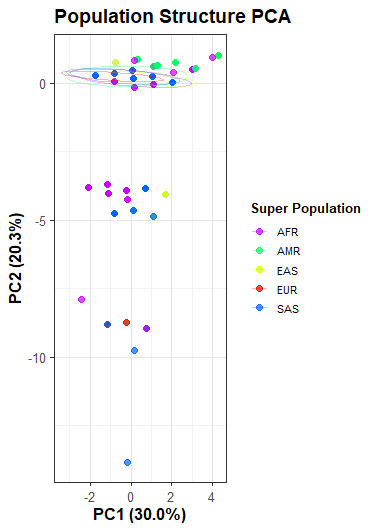
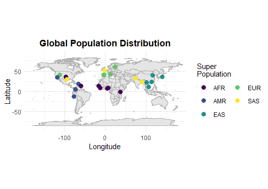

```{r, include = FALSE}
knitr::opts_chunk$set(
  collapse = TRUE,
  comment = "#>"
)
```

## Introduction
`genRelateR` genRelateR is a tool for analyzing global human genomic relatedness across populations. It enhances workflows in bioinformatics by providing exploratory analysis tools for genomic data. The package includes the main components: DESCRIPTION, NAMESPACE, man subdirectory and R subdirectory. Additionally, licence, README and subdirectories vignettes, tests, and data are also available. It was written in R Markdown, using the [knitr](https://cran.r-project.org/package=knitr) package for production. See `help(package = "genRelateR")` for further details. 

To download **genRelateR**, use the following commands:

``` r
options(repos = BiocManager::repositories())
require("devtools")
devtools::install_github("bdls-jamal/genRelateR", build_vignettes = TRUE)
library("genRelateR")
```
To list all sample functions available in the package:
``` r
ls("package:genRelateR")
```

To list all sample datasets available in the package:
``` r
data(package = "genRelateR")
```
You may add more datasets from https://www.internationalgenome.org/data/

## Initialization and Environment Setup
```{r setup, include = FALSE}
library(genRelateR) # Load the package
```

Ensure that lines 151 and 159 in loadAndCleanData.R show the correct file path
to population code and long/latitude information text files.

## Tutorial: Analyzing Population Data
### Data Preparation and Fetching

The genRelateR package works with data from the 1000 genomes project. In order to get started, you will need data from this project. Below is an example of how to download this data, you may use the example in your analysis, or choose alternative files as long as you can find the associated:

1. VCF (Variant Call Format) Files
2. VCF.tbi files
3. Population Metadata Files

First we must choose a 1000 genomes project release folder as our base URL to download files from. Then we choose the specific files to download from within this release folder:
``` r
# Define the base FTP URL(you may choose a different release)
base_url <- "ftp://ftp.1000genomes.ebi.ac.uk/vol1/ftp/release/20130502/"

# Specify the filenames for the VCF and .tbi files(example only below)
vcf_file <- "ALL.chr1.phase3_shapeit2_mvncall_integrated_v5b.20130502.genotypes.vcf.gz"
tbi_file <- paste0(vcf_file, ".tbi")
```
Next, we may create a folder for storing downloaded files, this may be an already existing folder. If it doesn't exist, it will be created for you. Using this new folder, setup the full destination paths for the downloads.
``` r
# Specify the destination folder (create it if it doesn’t exist)
dest_folder <- "data/vcf_files"
if (!dir.exists(dest_folder)) {
  dir.create(dest_folder, recursive = TRUE)
}

# Define the full destination paths
vcf_dest <- file.path(dest_folder, vcf_file)
tbi_dest <- file.path(dest_folder, tbi_file)
```
Download the files to the desired destination folder.
``` r
# Download the VCF and .tbi files
download.file(url = paste0(base_url, vcf_file), destfile = vcf_dest, mode = "wb")
download.file(url = paste0(base_url, tbi_file), destfile = tbi_dest, mode = "wb")
```
In the exact same way as with the vcf and tbi files, we may download the necessary population metadata files from this package's GitHub repository(can be found from 1000 genomes project files as well).
``` r
# Download population metadata files, or grab from github repo
pop_codes_url <- "https://raw.githubusercontent.com/bdls-jamal/genRelateR/main/inst/extdata/population_codes.txt"
pop_long_lat_url <- "https://raw.githubusercontent.com/bdls-jamal/genRelateR/main/inst/extdata/population_long_lat.txt"
pop_metadata_url <- "https://raw.githubusercontent.com/bdls-jamal/genRelateR/main/inst/extdata/population_metadata.txt"

dest_folder <- "data"

pop_codes_dest <- file.path(dest_folder, "population_codes.txt")
pop_long_lat_dest <- file.path(dest_folder, "population_long_lat.txt")
pop_metadata_dest <- file.path(dest_folder, "population_metadata.txt")

download.file(url = pop_codes_url, destfile = pop_codes_dest, mode = "wb")
download.file(url = pop_long_lat_url, destfile = pop_long_lat_dest, mode = "wb")
download.file(url = pop_metadata_url, destfile = pop_metadata_dest, mode = "wb")

```
### Functional Calling

Now that our files are ready to be analyzed, we must load the vcf file data, ensuring that the associated tbi file is within the same folder as the vcf(or you may generate a new one using Tabix). To perform the load, setup variables with paths to your files, then define a region of analysis(necessary since files are large).
``` r
# Example: vcf_file <- "inst/extdata/vcf/ALL.chr1.phase3_shapeit2_mvncall_integrated_v5b.20130502.genotypes.vcf.gz"
vcf_file <- "path/to/your/vcf.gz/data"

# Define a region(range) for analysis(required for very large data files)
chr1_region <- GRanges(
  seqnames = "1",
  ranges = IRanges(start = 20000000, end = 20001000)
)

# Call loadGeneticData function with specified region and vcf file
genetic_data <- genRelateR::loadGeneticData(vcf_file, regions = chr1_region)
```
Now it is time to filter our loaded data to cater to our analysis needs. Load the metadata files into variables, define a vector of population codes you want to analyze, and perform the filtering.
``` r
# Create population metadata object from metadata file
# File is provided for 1000 genome project use, for other data you must use with your own data
# Example: pop_metadata <- "inst/extdata/population_metadata.txt"
pop_metadata <- "path/to/your/metadata.txt/file"

# Choose populations to filter by(all are selected in this example)
populations <- c(
  "CHB", "JPT", "CHS", "CDX", "KHV",
  "CEU", "TSI", "GBR", "FIN", "IBS",
  "YRI", "LWK", "GWD", "MSL", "ESN",
  "ASW", "ACB", "MXL", "PUR", "CLM",
  "PEL", "GIH", "PJL", "BEB", "STU", "ITU"
)

# Call filterPopulation with loaded data, metadata, and specified populations
filtered_data <- genRelateR::filterPopulation(genetic_data, pop_metadata, populations)
```
Now that we have loaded and filtered our data, we can begin analyses. The example below uses Principal Component Analysis(PCA) and uses the filtered data object from the previous filtering function.
``` r
# Perform population structure analysis by calling analyzePopulationStructure
pca_results <- genRelateR::analyzePopulationStructure(
  filtered_data$vcf_data,
  filtered_data$pop_metadata,
  method = "pca"
)
```
Plot your analysis results! To customize your plot, you can toggle the use of ellipses, change the title, and organize plot points by super population or not.
``` r
# Create PCA data cluster visualization
# Call plotPopulationPca then print to view
pca_plot <- genRelateR::plotPopulationPca(
  analysis_results = pca_results,
  filtered_data$pop_metadata,
  title = "Population Structure PCA",
  ellipses = TRUE,
  super_pop = TRUE
)
print(pca_plot)
```


Using the same PCA analysis results data, we can plot the ancestry of the different populations on a real world map. Customizable title and super population vs not options are available.
``` r
# Create PCA data map visualization
# Call plotAncestryMap then print to view
ancestry_map <- genRelateR::plotAncestryMap(
  pca_results,
  filtered_data$pop_metadata,
  title = "Global Population Distribution"
)
print(ancestry_map)
```


## This Package References

Schmalenberg, K. (2024) genRelateR: R Package Development for BCB410H. Unpublished. https://github.com/bdls-jamal/genRelateR

## Other References
- Becker, R. A., Chambers, J. M. and Wilks, A. R. (1988) The New S Language. Wadsworth & Brooks/Cole.
- Mardia, K. V., J. T. Kent, and J. M. Bibby (1979) Multivariate Analysis, London: Academic Press.
- R Core Team (2024). _R: A Language and Environment for Statistical
  Computing_. R Foundation for Statistical Computing, Vienna, Austria.
  <https://www.R-project.org/>.
- Susan Fairley, Ernesto Lowy-Gallego, Emily Perry, Paul Flicek, The International Genome Sample Resource (IGSR) collection of open human genomic variation resources, Nucleic Acids Research, Volume 48, Issue D1, 08 January 2020, Pages D941–D947, https://doi.org/10.1093/nar/gkz836
- The 1000 Genomes Project Consortium. A global reference for human genetic variation. Nature 526, 68–74 (2015). https://doi.org/10.1038/nature15393
- Venables, W. N. and B. D. Ripley (2002) Modern Applied Statistics with S, Springer-Verlag.

### Packages Used
- Barrett T, Dowle M, Srinivasan A, Gorecki J, Chirico M, Hocking T, Schwendinger B (2024). _data.table: Extension of `data.frame`_. R package version 1.16.0, <https://CRAN.R-project.org/package=data.table>.
- Becker OScbRA, Minka ARWRvbRBEbTP, Deckmyn. A (2023). _maps: Draw Geographical Maps_. R package
  version 3.4.2, <https://CRAN.R-project.org/package=maps>.
- Csardi G, Nepusz T (2006). “The igraph software package for complex network research.”
  _InterJournal_, *Complex Systems*, 1695. <https://igraph.org>.
- C. Sievert. Interactive Web-Based Data Visualization with R, plotly, and shiny. Chapman and Hall/CRC
  Florida, 2020.
- Lawrence M, Huber W, Pag\`es H, Aboyoun P, Carlson M, et al. (2013) Software for Computing and
  Annotating Genomic Ranges. PLoS Comput Biol 9(8): e1003118. doi:10.1371/journal.pcbi.1003118
- Neuwirth E (2022). _RColorBrewer: ColorBrewer Palettes_. R package version 1.1-3,
  <https://CRAN.R-project.org/package=RColorBrewer>.
- Obenchain V, Lawrence M, Carey V, Gogarten S, Shannon P, Morgan M (2014). “VariantAnnotation: a
  Bioconductor package for exploration and annotation of genetic variants.” _Bioinformatics_, *30*(14),
  2076-2078. doi:10.1093/bioinformatics/btu168 <https://doi.org/10.1093/bioinformatics/btu168>.
- Simon Garnier, Noam Ross, Robert Rudis, Antônio P. Camargo, Marco Sciaini, and Cédric Scherer (2024).
  viridis(Lite) - Colorblind-Friendly Color Maps for R. viridis package version 0.6.5.
- Slowikowski K (2024). _ggrepel: Automatically Position Non-Overlapping Text Labels with 'ggplot2'_. R
  package version 0.9.6, <https://CRAN.R-project.org/package=ggrepel>.
- Wickham H, Averick M, Bryan J, Chang W, McGowan LD, François R, Grolemund G, Hayes A, Henry L, Hester
  J, Kuhn M, Pedersen TL, Miller E, Bache SM, Müller K, Ooms J, Robinson D, Seidel DP, Spinu V,
  Takahashi K, Vaughan D, Wilke C, Woo K, Yutani H (2019). “Welcome to the tidyverse.” _Journal of Open
  Source Software_, *4*(43), 1686. doi:10.21105/joss.01686 <https://doi.org/10.21105/joss.01686>.
- Wickham H, François R, Henry L, Müller K, Vaughan D (2023). _dplyr: A Grammar of Data Manipulation_.
  R package version 1.1.4, <https://CRAN.R-project.org/package=dplyr>.
- Wickham H. ggplot2: Elegant Graphics for Data Analysis. Springer-Verlag New York, 2016.
- Wickham H, Hester J, Bryan J (2024). _readr: Read Rectangular Text Data_. R package version 2.1.5,
  <https://CRAN.R-project.org/package=readr>.
- Wickham H, Vaughan D, Girlich M (2024). _tidyr: Tidy Messy Data_. R package version 1.3.1,
  <https://CRAN.R-project.org/package=tidyr>.
- Wickham H (2023). _stringr: Simple, Consistent Wrappers for Common String Operations_. R package
  version 1.5.1, <https://CRAN.R-project.org/package=stringr>.

----
```{r}
sessionInfo()
```
